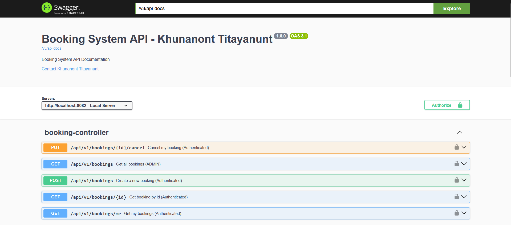
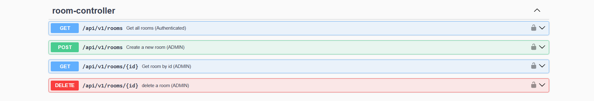
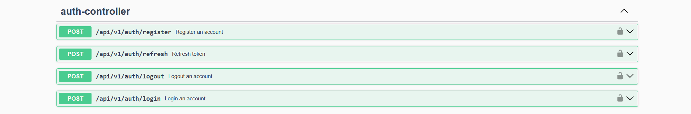
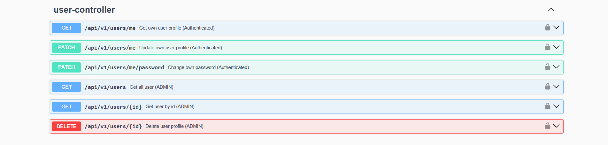
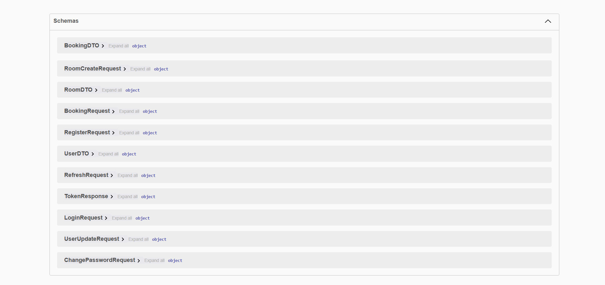

# 📘 General-Purpose Booking System

> ## Why this project exists
>
> I started this project to solve a very real problem I face as students. My university’s music rooms open for booking at 08:00—onsite only. If you’re not physically there right on time, all slots are gone. That means early commutes, long lines, and lots of frustration just to secure a practice session.

> ## What I'm building
>
> A reliable, fair, and transparent booking system that:

- Enforces the official 08:00 booking window and prevents early grabs
- Shows real-time availability and stops overlapping or double bookings
- Lets students book remotely with clear rules (slot lengths, limits, cancellations)
- Gives admins simple tools to manage rooms, set policies, and audit usage

Result: No more 8 AM rushes, fewer empty rooms, and more predictable practice time.

> ## What's about
>
> A flexible booking system powered by Spring Boot and PostgreSQL, designed to fit multiple use cases (music rooms, table-tennis courts, study rooms, etc.). It showcases a clean, scalable backend architecture with DTO-first endpoints, real-world validation (overlap checks, time-window rules), global exception handling, JWT authentication, and hashed passwords/tokens stored securely—following best practices for production-grade systems.

# 🚀 Features

## Auth Management

- Register
- Login
- Access and Refresh tokens

## User Management

- Fetch users
- Delete users
- Roles: USER, ADMIN
- Passwords safely hidden from API responses

## Room Management

- Create rooms
- Fetch Rooms
- Delete rooms
- Designed to be extendable (different room types, availability slots)

## Booking Management

- Create a booking
- Cancel a booking
- Fetch all bookings or by ID
- User get their own bookings detail
- Bookings keep status (CANCELLED) instead of being deleted

## DTO + Mapper Architecture

- Entities never exposed directly
- Request DTOs
- Response DTOs
- Mappers handle conversion between entities and DTOs

# 🛠 Tech Stack

- Backend Framework: Spring Boot 3.5.5 (Java 21)
- Database: PostgreSQL (via Spring Data JPA)
- Build Tool: Maven
- Containerization: Docker & Docker Compose
- API Testing: Postman
- API Documentation: SwaggerUI/OpenAPI

# 📂 Project Structure

```text
src/main/java/com/bookingsystem/booking/
|
├─ booking
| ├─ api
| | ├─ controllers
| | ├─ dtos
| | | ├─ request
| | | ├─ response
| | ├─ mappers
| ├─ data
| ├─ domain
| | ├─ entities
| | ├─ enums
| ├─ service
|
├─ room
| ├─ api
| | ├─ controllers
| | ├─ dtos
| | | ├─ request
| | | ├─ response
| | ├─ mappers
| ├─ data
| ├─ domain
| | ├─ entities
| | ├─ enums
| ├─ service
|
├─ shared
| ├─ auth
| | ├─ api
| | ├─ dto
| | | ├─ request
| | | ├─ response
| | ├─ service
| | ├─ tokens
| ├─ config
| ├─ crypto
| ├─ error
| | ├─ exception
| | ├─ handler
| ├─ security
|
├─ user
| ├─ api
| | ├─ controllers
| | ├─ dtos
| | | ├─ request
| | | ├─ response
| | ├─ mappers
| ├─ data
| ├─ domain
| | ├─ entities
| | ├─ enums
└─── service
```

# SwaggerUI/OpenAPI

## Booking



## Room



## Auth



## User



## Schemas



# 📡 API Endpoints

## Authentication

- POST /api/v1/auth/register → Register new user
- POST /api/v1/auth/login → Login with existed user
- POST /api/v1/auth/refresh → Get refresh token after accesstoken expired
- POST /api/v1/auth/logout → Logout

## Users

- GET /api/v1/users → Get all users (ADMIN)
- GET /api/v1/users/{id} → Get user by ID (ADMIN)
- DELETE /api/v1/users/{id} → Delete user (ADMIN)
- GET /api/v1/users/me → User get their own profile (Authenticated)
- PATCH /api/v1/users/me → User edit and update their profile (Authenticated)
- PATCH /api/v1/users/me/password → User change their password (Authenticated)

## Rooms

- POST /api/v1/rooms → Create a room (ADMIN)
- GET /api/v1/rooms → Get all rooms (Authenticated)
- GET /api/v1/rooms/{id} → Get room by ID (ADMIN)
- DELETE /api/v1/rooms/{id} → Delete room (ADMIN)

## Bookings

- POST /api/v1/bookings → Create a booking (Authenticated)
- PATCH /api/v1/bookings/{id}/cancel → Cancel a booking (Authenticated)
- GET /api/v1/bookings → Get all bookings (ADMIN)
- GET /api/v1/bookings/{id} → Get booking by ID (Authenticated)
- GET /api/v1/bookings/me → User get their own bookings (Authenticated)

# 📅 Roadmap

- [x] User, Room, Booking entities
- [x] Services with CRUD
- [x] Controllers with Request/Response DTOs
- [x] Mapper layer for clean API responses
- [x] Add validation
- [x] Add global exception handling
- [x] Add authentication & JWT
- [x] Swagger/OpenAPI
